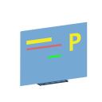

# pyspage 

Quickly build open source web pages for academic purposes in a pythonic and elegant way.

## Installation
*temporarily unavailable*
```shell
pip install pyspage
```

## Usage

### Step 1

Create a new file named `index.py` which consists of mainly two parts, **layout** and **script**.

In the layout part, a `layout` variable should be defined, of which the contents are the page elements named in a way you like. The hierarchical relationships are expressed by indenting.

```python
layout = '''
box_a
    btn_b
    btn_c
'''
```

In the script part, all the elements above should be created.

```python
from pyspage.elements import Box, Button

box_a = Box()
btn_b = Button('CLICK B')
btn_c = Button('CLICK C')
```

You can define a function and let an element run it on a certain event happens.

```python
btn_b.onclick = lambda e: print('B is clicked!')

def click_c(e):
    print('C is clicked!')
btn_c.onclick = click_c
```

Also, if you have created a figure with `matplotlib` or `altair`, you can show the figure in an empty box, e.g. <del> `box_b.write(fig)`</del> .

### Step 2

In your terminal, run as follow
```shell
pyspage index.py
```

a `index.html` in current direction are generated. This page can then be deployed on the [GitHub Page](https://pages.github.com/), you don't have to bother about anything else.🎉🎉🎉

## License
[MIT License](LICENSE)