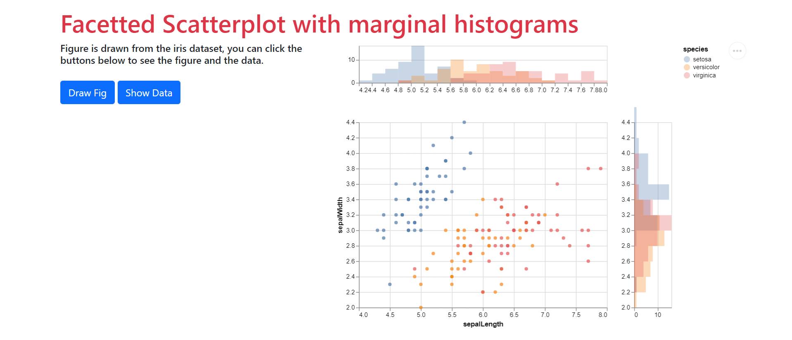

# pyspage 

Quickly build open source web pages for academic purposes in a pythonic and elegant way.

pyspage makes it possible to build web pages with sophisticated logic from a single Python script. What pyspage actually does is turn a plain `.py` file into a valid [pyscript](https://pyscript.net/) page, you don't have to worry about anything other than what you really want to do.

## Installation

```shell
pip install pyspage
```

## An Example

Go to directory `demo/`, there is already a script `scatter_hist.py`.

```shell
pyspage scatter_hist.py -sb
```

A file named `scatter_hist.html` is generated, your browser opens a tab and show it.



## Usage

### Step 1

Create a new file named `index.py` which consists of mainly two parts, **layout** and **script**.

In the layout part, a `layout` variable should be defined, of which the contents are the page elements named in a way you like. The hierarchical relationships are expressed by indenting.

```python
layout = '''
row_a
    box
row_b
    col_a
        btn_a
    col_b
        btn_b
'''
```

In the script part, all the elements above should be created.

```python
from pyspage import *
import matplotlib.pyplot as plt

row_a = Row()
row_b = Row()
col_a = Column()
col_b = Column()
box   = Column(class_='col-6')
btn_a = Button('CLICK a')
btn_b = Button('CLICK b')
```

You can define a function and let an element run it on a certain event happens.

```python
btn_a.onclick = lambda e: print('a is clicked!')

def click_b(e):
    fig, ax = plt.subplots()
    fruits = ['apple', 'blueberry', 'cherry', 'orange']
    counts = [40, 100, 30, 55]
    ax.bar(fruits, counts)
    box.write(fig)
btn_b.onclick = click_b

def create_box():
    row_a.classList.add('bg-warning')
    box.write('This is the content.')
box.oncreate = create_box
```

You can create a figure with `matplotlib` or `altair`, and show it in an empty box(`row` or `column`) by `box.write(fig)`.

### Step 2

In your terminal, run as follow
```shell
pyspage index.py
```

a `index.html` in current directory is generated. 

If you use the arguments `-s`(for server) and `-b`(for browser), pyspage will start a server on 127.0.0.1:8000 and open browser automatically.

```shell
pyspage index.py -sb
```

## Deployment

This page can then be deployed on [GitHub Pages](https://pages.github.com/), you don't have to bother about anything with HTML, JS or backend APIs.🎉🎉🎉

The easiest way to use GitHub Pages with your built HTML is to use the `ghp-import` package. ghp-import is a lightweight Python package that makes it easy to push HTML content to a GitHub repository.

ghp-import works by copying all of the contents of a folder to a branch of your repository called **gh-pages**, and pushes it to GitHub. The gh-pages branch will be created and populated automatically for you by ghp-import.

1. Install `ghp-import`.

```shell
pip install ghp-import
```

2. Call ghp-import and point it to the directory containing your HTML files. 

```shell
ghp-import -n -p -f demo/
```

Now goto https://chunribu.github.io/pyspage/scatter_hist.html .The URL format is always *{USER}.github.io/{REPOSITORY}/{FILENAME}*. The filename can be omitted by changing name to `index.html`.

Deployment is that easy!🎉🎉🎉

*Tips:*

- *Make sure that you included the `-n`, it tells GitHub not to build your book with Jekyll, which we don’t want because our HTML is already built.*

- *You may neet to update the settings for your GitHub pages site:*

    - *Use the `gh-pages` branch to host your website.*

    - *Choose root directory `/`.*

## Supported Elements (Todo List)

- [x] Row
- [x] Column
- [x] Text
- [x] Button
- [x] Input
- [x] Textarea
- [x] SelectOne
- [ ] SelectMulti
- [ ] File
- [ ] Image

## License
The [MIT License](LICENSE).
